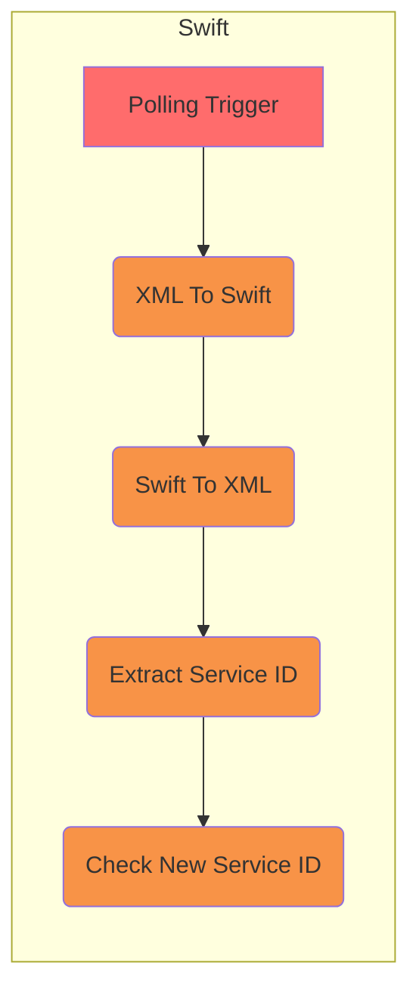

# Swift Testing

Project tests interlok-swift features

## What it does

This project is very simple and contains only one single channel with one workflow.

The workflow has a polling trigger that produces an XML message with a serviceId metadata every 10 seconds.
Then a service convert the XML message to a Swift message, another one transform the Swift message back to XML, then a Xpath service extract the service id from the XML and add it to a metadata.
Finally a If service check if the new service id equals the original one and throws an exception if it doesn't.

The polling trigger has a message provider that uses an Embedded Scripting Service to create the XML message and add the serviceId metadata.
The serviceId is a random number bewteen 1 and 10 and is not added as a metadata when its value is 9 to simulate some sporadic failures.

## Getting started

* `./gradlew clean build`
* `(cd ./build/distribution && java -jar lib/interlok-boot.jar)`
